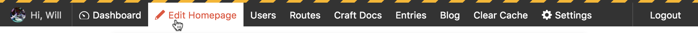
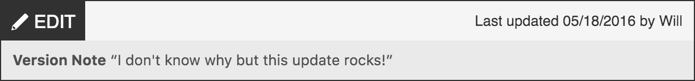
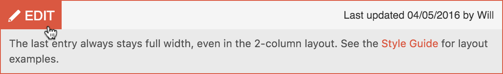
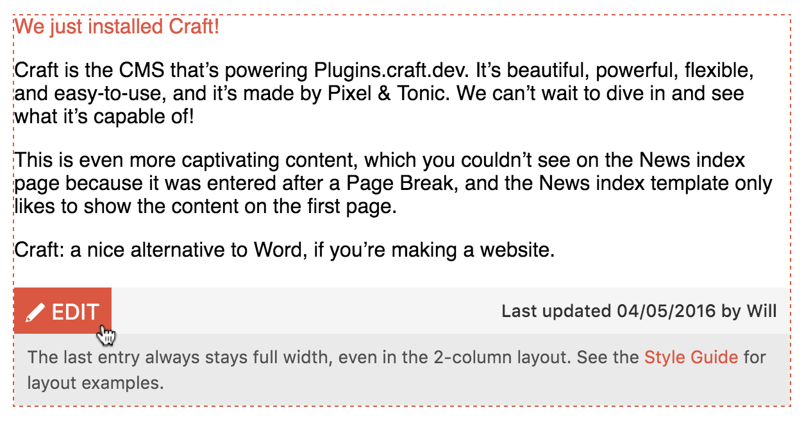

# Craft – Admin Bar
Front-end shortcuts for clients logged into [Craft CMS](https://craftcms.com).

> NOTE: This is the Craft 2.x version of Admin Bar. [Here's the Craft 3 version](https://github.com/wbrowar/craft-3-adminbar).

## Requirements
* Craft 2.6+
* PHP 5.3+

## Installation
1. Move the `adminbar/` folder to your `craft/plugins/` folder.
2. Enable the plugin in the CP.
3. Copy `config.php`, paste it into your `craft/config/` folder, and rename it to `adminbar.php`.
4. Add one of the Twig tags to your template:
  * [Admin Bar default hook](https://github.com/wbrowar/adminbar#add-the-default-admin-bar)
  * [Admin Bar Twig tag](https://github.com/wbrowar/adminbar#using-the-admin-bar-twig-tag)
  * [Entry Edit Link Twig tag](https://github.com/wbrowar/adminbar#edit-links-for-multiple-entries)

---

# Admin Bar



## Add the Default Admin Bar
The easiest way to add Admin Bar to your website is by adding the hook, ``, anywhere within your page template. Admin Bar will appear at the top of any page that includes this hook when someone—who has the permission to view the CP—is logged into your website.

Because Admin Bar is HTML, CSS, and Javascript added to your website's front-end, you may need to make some slight adjustments to override Admin Bar's CSS to make it fit your website.

## Using the Admin Bar Twig Tag
Using the hook method to add Admin Bar to your template is the same as using the Admin Bar Twig tag, but the Twig tag allows you more flexibility.

Use the tag, `{{ craft.adminbar.bar() }}`, to add Admin Bar anywhere you'd like within your template.

You may pass in an array of arguments to make some changes on how Admin Bar looks and functions. In this example, you may pass in the entry that you'd like to appear when someone clicks the "Edit" link.

```twig


{{ craft.adminbar.bar(config) }}
```

Here is a list of available arguments:

| Argument | Default | Description |
| --- | --- | --- |
| `category` | *null* | Pass in a category object to add an edit link for that category |
| `color` | *'#d85b4b'* | Color used for rollovers and for the background of the mobile theme |
| `entry` | *null* | Pass in an entry object to add an edit link for that entry |
| `sticky` | *true* | Uses css to `position: fixed;` Admin Bar to the top of the page |
| `useCss` | *true* | Add the default styles to Admin Bar or leave them off and style it your way |
| `useJs` | *true* | Use the Admin Bar's default Javascript |

---

# Entry Edit Links



## Edit Links for Multiple Entries
When looping through entries in an Element Criteria Model, entries in search results, or related entries to a page, you can now place edit links that make it easier to find and edit these entries.

To add an Entry Edit Link, use the tag, `{{ craft.Adminbar.edit(entry) }}`, and pass in the entry you'd like the link to edit. You could also use Entry Edit Links to add shortcuts to other areas of the CP by passing in a string, `{{ craft.Adminbar.edit(craft.config.cpTrigger ~ '/categories/myCategories/5-some-category-page') }}`.

By default, Entry Edit Links use Javascript to add the links to your page, so you can feel free to use `` tags around the Twig tag. The only thing a non-logged in user would see is this in the HTML markup: `<div class="admin_edit" data-id="0"></div>`.

You can also add developer notes to content editors, or pass along other arguments.

```twig

  
    <p>The last entry always stays full width, even in the 2-column layout. See the <a href="{{ url('style-guide') }}">Style Guide</a> for layout examples.</p>
  


{{ craft.Adminbar.edit(entry, {
  devNote: myNote,
}) }}
```


Here is a full list of available arguments:

| Argument | Default | Description |
| --- | --- | --- |
| `color` | *'#d85b4b'* | Color used for rollovers and links |
| `containerSelector` | *null* | Outline a parent element to show content editors the entirety of an entry. [See below for an example](https://github.com/wbrowar/adminbar#inidcating-what-will-change-when-editing-an-entry) |
| `devNote` | *null* | Display information to content editors. You may use plain text or HTML markup |
| `showEditInfo` | *true* | If set to `true`, the Entry Edit Link will display the last updated date and the name of the author that last saved the entry |
| `useCss` | *true* | Add the default styles to Entry Edit Links or leave them off and style it your way |
| `useJs` | *true* | Add the default Javascript used by Entry Edit Links. Setting this to `false` embeds the Entry Edit Link through Twig, instead |

### Inidcating What Will Change When Editing an Entry
To help a content editor realize what part of an entry is editable, the `containerSelector` argument can select a containing parent HTML element of the Entry Edit Link Twig tag. For example, in the code below, by setting `containerSelector` to `'li'`, an outline would appear when a content editor rolls over the `<li>` element on the page.

```twig
<ul class="my_sweet_content">
  
    <li>
      <h3>{{ summary.title }}</h3>
      <p>{{ summary.teaser }}</p>
      <a href="{{ summary.url }}">Read more</a>
      
      {{ craft.Adminbar.edit(summary, {
        containerSelector: 'li',
      }) }}
    </li>
  
</ul>
```



---

## Configuration settings
The config file gives you the ability to adjust how Admin Bar looks and functions in multiple environments. It also allows you to create additional links for the Admin Bar, and allows for plugin actions to be called through these additional links.

Here are some settings you can change with the config file:

### Admin Bar

| Setting | Default | Description |
| --- | --- | --- |
| `additionalLinks` | *array()* | Add links to Admin Bar using the [properties found below](https://github.com/wbrowar/adminbar#additional-links) |
| `cacheBar` | *true* | Enable caching of Admin Bar links |
| `displayGreeting` | *true* | Displays the logged in user's photo (if it's set) and "Hi, [friendlyname]" |
| `displayDashboardLink` | *true* | A link to the CP Dashboard |
| `displaySettingsLink` | *true* | A link to the CP Settings page that appears only to admins |
| `displayLogout` | *true* | Logs you out of Craft CMS |
| `enableMobileMenu` | *true* | Enables Admin Bar to display a separate mobile theme below a width of 600 pixels |
| `scrollLinks` | *true* | Enable Admin Bar to scroll horizontally when the browser window doesn't have enough room for all of the links |

### Entry Edit Links

| Setting | Default | Description |
| --- | --- | --- |
| `displayEditDate` | *true* | Shows the date of the last time the entry was updated |
| `displayEditAuthor` | *true* | Shows the `friendlyName` of the person who last saved the entry |
| `displayRevisionNote` | *true* | Displays text added to the "Notes about your changes"—a.k.a. Version Notes—field found when editing an entry |

#### Additional Links
You can add links to Admin Bar using the config file by passing properties into an array, called `additionalLinks`. There are examples commented out in the `config.php` file, and here are the properties you can use to create links.

| Property | Values | Description |
| --- | --- | --- |
| `title` | *string* | Appears as the label for the link |
| `url` | *string* | Depending on the `type` property, the `url` represents the location or action of the link |
| `title` | `'url'`, `'cpUrl'`, `'action'` | If the `type` is `'url'`, the `url` value should be an absolute URL or a path relative to the site root. If the `type` is `'cpUrl'`, the `url` value should be a path relative to your site's CP root. If the `type` is `'action'`, set the value for `url` to the path used by the Controller Action |
| `params` | *string* | Passes along url parameters, as [documented here](https://craftcms.com/docs/templating/functions#url). This only supports this string format: `'foo=1&bar=2'` |
| `protocol` | *string* | Changes the url protocol, as [documented here](https://craftcms.com/docs/templating/functions#url) |
| `mustShowScriptName` | *string* | Appends `index.php`, as [documented here](https://craftcms.com/docs/templating/functions#url) |
| `permissions` | *array* | An array of required permissions that are needed for this link to be displayed. All permissions in this array will be required for the link to appear |

---

## Build Tool Extras
If you are using a build tool, such as [Grunt](http://gruntjs.com) or [Gulp](http://gulpjs.com), and you are using the Twig tag with `useCss` and/or `useJs` set to `false`, AND your `plugins` folder happens to be within your build tool root folder, you can find the uncompressed, un-[autoprefixed](https://github.com/postcss/autoprefixer) CSS and Javascript files at this location: `adminbar/buildsource/`. This could be helpful if you want to include Admin Bar CSS into your own stylesheet or modify the Javascript code.

---

## Upgrading from 1.x
The 2.0 release of Admin Bar will break sites using the 1.x Twig tag and sites using Admin Bar's Auto Embed features will no longer display the Admin Bar on the front-end. Since we're breaking the plugin code, anyway, this let me move some settings into an `adminbar.php` config file. Between upgrading the Twig tag and the new config file, Admin Bar *shouldn't* need to go through another breaking change like this until a Craft 3 release (fingers crossed emoji).

In learning how to write code better within Twig templates and Craft plugins, alike, I've made several adjustments that should improve the performance of Admin Bar and the new Entry Edit Links feature. The 2.0 release also gave me an excuse to remove a few features that were either underused (based on feedback) or just plain confusing.

The 1.x branch will remain here on GitHub, but I don't plan on supporting it going forward. If you would still like to use it and you come across any bugs, please do a pull request with any fixes you can figure out and I'll make sure to commit it in.

### Updating the Twig Tag
The Twig tag changed for the sake of a more flexible approach. By passing in one array—and by smarter handling of arguments—more arguments can easily be added in the future. There's also no longer the need to pass in required arguments in a specific order.

If you're using the *1.x* Twig tag that looks like this:
```twig
{{ craft.Adminbar.show(entry, 'rgb(255, 0, 128)', 'bar') }}
```

Change the tag to this:

```twig


{{ craft.adminbar.bar(config) }}
```

There are [more options you can pass into the Twig Tag](https://github.com/wbrowar/adminbar#using-the-admin-bar-twig-tag).

### Removing Auto Embed
The Auto Embed feature in 1.x turned out to cause issues for other plugins that rendered templates on the front-end. The short explanation is that if another plugin was planning on rendering a template, but Admin Bar happened to be loaded first, Admin Bar's render function would trick the other plugins into rendering their code before they have an opportunity to configure their template properly. Since it's not cool to step on other plugins, I've removed Auto Embed and replaced it with a simple hook: ``.

The side-effect of switching to the hook method is that Admin Bar appearing on the front-end is now completely controlled by a Twig template, instead of confusion that might occur by adding front-end code through the CP.

### Changes to the CP Settings page
While the Auto Embed feature is now gone, all other settings made by developers or clients in the Admin Bar CP Settings page should remain the same. This includes the color picker for the default highlight color and the Custom Links field that allows for links to be added via the CP.

---

## To Do
* ~~New icon :horse:~~
* Update plugin to support Craft 3
* ~~Add a new type to be used within multiple entries.~~
* ~~Change—in Craft 3 version—Embed Options in Embed Tag to array~~

---

## Releases

Release notes can be found at [releases.json](https://github.com/wbrowar/adminbar/blob/master/releases.json)

Please, let me know if this plugin is useful or if you have any suggestions or issues. [@wbrowar](https://twitter.com/wbrowar)