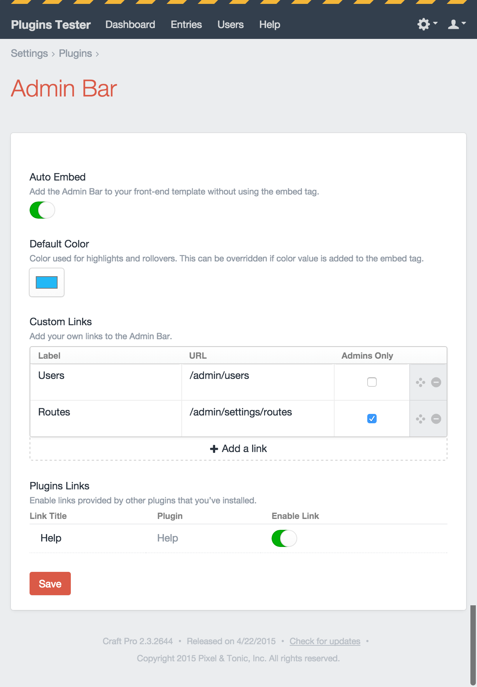

# Craft – Admin Bar
Simple front-end shortcut bar for users logged into [Craft CMS](https://buildwithcraft.com).


> NOTE: 1.4 might have some bugs related to caching, so please send your feedback my way if you find any

## Installation
1. Upload the adminbar/ folder to your craft/plugins/ folder.
2. Enable the plugin in the CP.
3. Either add the Admin Bar through the plugin settings page, or add the tag, `{{ craft.Adminbar.show(entry) }}`, to your template.

## Auto Embed
Using the "Auto Embed" setting will add the Admin Bar to the top of your `<body>` tag. Doing it this way will base the "Edit" button off of the current page entry. Branding colors will use the color selected through the "Default Color" color picker.

For more control, or to add the admin bar to multiple entries, use the Twig embed tag, below. _NOTE: using Auto Embed caches Admin Bar automatically, where using the Embed Tag leaves caching up to you._

## Embed Options
Format: `{{ craft.Adminbar.bar(currentEntry, color, type) }}`

Embedding the Admin Bar using this tag will let you overwrite the settings found on the plugin settings page.

* **currentEntry** *`entry`*  – Current entry passed in as a TWIG object.
* **color** *`'#d85b4b'`* – The color used for rollovers or highlights. You can change this to better fit the branding of your website. Use any CSS color format.
* **type** *`'bar'`* – Changes the style of the Admin Bar. For now, the only options are `bar` or `none`.
  * `bar` – Creates a black bar that spans 100% the width of the element that it is placed in. It's *slightly* responsive.
  * `none` – Has the same markup as `bar`, but removes all of the CSS, so you may style it however you'd like.

## Adding Links Through Plugins
Links can be added through the `addAdminBarLinks()` method in your main plugin class. Return an array for each link you'd like to add.

```php
public function addAdminBarLinks() {
  return array(
    // an example of a simple url link
    array(
      'title' => 'Craft',
      'url' => 'http://buildwithcraft.com',
      'type' => 'url',
    ),
    // an example of a CP link
    array(
      'title' => 'Entries',
      'url' => 'entries',
      'type' => 'cpUrl',
    ),
    // an example of a url link that passes along some extras
    array(
      'title' => 'Blog',
      'url' => 'blog',
      'type' => 'url',
      'params' => 'foo=1&bar=2',
      'protocol' => 'http',
      'mustShowScriptName' => true,
      'permissions' => array('myPluginPermission', 'thisIsRequiredToo'),
    ),
  );
}
```

* **title** *required*  – The label that will appear for this link in the Admin Bar.
* **url** *required* – The url or path used for the link.
* **type** *required* – The context of the url or path.
  * `url` – Used for relative or absolute URLs.
  * `cpUrl` – Prepends `cpTrigger` to the **url** value for links found within the Control Panel. For example, if you wanted to link to Craft's default Entries page, set **url** to `'entries'` and **type** to `'cpUrl'`. The final url will be `http://example.com/admin/entries`
* **params** – Passes along url parameters, as [documented here](http://buildwithcraft.com/docs/templating/functions#url).
* **protocol** – Changes the url protocol, as [documented here](http://buildwithcraft.com/docs/templating/functions#url). This only supports this string format: `'foo=1&bar=2'`
* **mustShowScriptName** – Appends `index.php`, as [documented here](http://buildwithcraft.com/docs/templating/functions#url).
* **permissions** – An array of required permissions that are needed for this link to be displayed. All permissions in this array will be required.

*Please note: links in the Admin Bar are updated when the user saves the Admin Bar plugin settings. While you can use PHP to determine the argument values and which URLs appear based on your plugin's settings, the links will not update until the user goes back and updates their Admin Bar settings.*

### Plugins using Admin Bar
* [Craft Help](https://github.com/70kft/craft-help)



## Overriding the Edit Link
By default, Admin Bar will try to look for an `entry` or `category` object and use its `cpEditUrl` property to create the default "Edit" link. In some cases, you might want to change the label, or you might be using a different variable for an entry. It's not that common, but in these cases, you can add an array into your config.php file with the following:

```php
'adminBarEditLink' => array(
  array(
    'label' => 'Edit Page',
    'object' => 'entryAlias',
  ),
  array(
    'label' => 'Edit Page',
    'object' => 'entry',
  ),
  array(
    'label' => 'Edit Category',
    'object' => 'categoryAlias',
    'overrideEdit' => false,
  ),
),
```

In this case, Admin Bar will look for an entry object using the variable, "entryAlias". If it find that object, it will add a link, called "Edit Page", and if not it will look for the next object in the array, "entry". If it finds an "entry" object, it will add that link, as "Edit Page".

Adding `'overrideEdit' => false` will force a link to show up, even if there are other items above it, as long as the object it is referring to exists and has a `cpEditUrl`.

---

## Build Tool Extras
It is probably uncommon to need this, but: if you are using a build tool, such as [Grunt](http://gruntjs.com) or [Gulp](http://gulpjs.com), and you are using the embed tag with the type set to `none`, AND your `plugins` folder happens to be within your build tool root folder, you can find the uncompressed, un-[autoprefixed](https://github.com/postcss/autoprefixer) CSS at this location: `adminbar/buildsource/style.css`. This could be helpful if you want to include Admin Bar CSS into your own stylesheet.

---

## To Do
* Update plugin to support Craft 3
* Add a new type to be used within multiple entries. [Looking for some typical use case suggestions.](https://github.com/wbrowar/craft-admin-bar/issues/new)
* Change—in Craft 3 version—Embed Options in Embed Tag to array

---

## Releases
##### *1.4.0*
* Added per-user caching for the default Admin Bar when Auto Embed is on
* Added public hook to clear the Admin Bar cache, `clearAdminBarCache`
* Added option to make Admin Bar sticky to the top of the page when Auto Embed is on (if you're using the embed tag, you can do this with CSS: `position: fixed;`)
* Added embed tag example into plugin settings page
* Added more conditionals when the Auto Embed option is checked (thanks to PR from @lwilkowskeBC)
* Added ability to override default entry "Edit" link with any object that has the `getCpEditUrl` property (kind of still in beta)
* Changed embed tag from `craft.Adminbar.show()` to `craft.Adminbar.bar()` (`craft.Adminbar.show()` still works, but it is deprecated)
* Changed CSS and JS included in the front-end Admin Bar from `includecss` and `includejs` to `<style>` and `<script>` tags, respectively, so the Embed Tag can be included in cache tags
* Fixed issue where you could not delete all of your Custom Links

##### *1.3.4*
* Added permissions to `addAdminBarLinks()` for plugin authors.
* Added `url()` functions accross the board.

##### *1.3.3*
* Plugin authors can pass along [url() arguments](http://buildwithcraft.com/docs/templating/functions#url) into `addAdminBarLinks()`.
* Fixed some minor CSS issues in the front-end admin bar.

##### *1.3.2*
* @ktbartholomew helped me realize a much simpler way to integrate plugins links. **NOTE: the event has been removed, and this hook is taking its place.**
* Added plugin names on Admin Bar settings page.

##### *1.3.1*
* Fixed a couple of PHP 5.3 errors

##### *1.3.0*
* Added the logged in user photo. Just for kicks. :bust_in_silhouette:
* Added a new "Dashboard" link.
* Added `baseCpUrl` in front of root-relative links.
* Added support for plugins to add links to the Admin Bar.
* Added setting to enable/disable links added by plugins.
* Added example plugin for plugin makers.

##### *1.2.2*
* Changed the hard-coded url for the "Settings" link to use Craft's cpTrigger variable (thanks to @mildlygeeky for the tip).

##### *1.2.1*
* Fixed an error when checking for user permissions (flagged an error in devMode).

##### *1.2.0*
**NOTE:** Craft will ask you to make a one-time database update to accommodate the new options. 
* Added option to make custom links available only to users with the admin role.
* Added option to embed Admin Bar from the plugin settings page.
* Added color picker for default branding color.
* Removed duplicate CSS and JS code for multiple instances of the Admin Bar.

##### *1.1.0*
* Added ability to add custom links to CP settings.

##### *1.0*
* Basic admin bar with Edit, Settings, and Logout buttons.

Please, let me know if this plugin is useful or if you have any suggestions or issues. [@wbrowar](https://twitter.com/wbrowar)