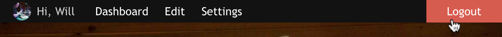

# Craft – Admin Bar
Simple front-end shortcut bar for users logged into Craft CMS.

## Installation
1. Upload the adminbar/ folder to your craft/plugins/ folder.
2. Enable the plugin in the CP.
3. In your template, add the tag `{{ craft.Adminbar.show(entry) }}` at the top of the `<body>` tag or wherever you want it to show up.

## Options
> Format: `{{ craft.Adminbar.show(currentEntry, color, type) }}`
* **currentEntry** – Current entry passed in as a TWIG object.
* **color** – The color used for rollovers or highlights. You can change this to better fit the branding of your website.
* **type** – Changes the style of the Admin Bar. For now, the only options are `bar` or `none`.
  * *bar* – creates a black bar that spans 100% the width of the element that it is placed in. It's *slightly* responsive.
  * *none* – Has the same markup as `bar`, but removes all of the CSS, so you may style it however you'd like.

## To Do
* Add options to CP.
* Add a new type to be used within multiple entries.
* Automatically add the bar to the top of the `<body>` tag depending on options selected (is this a good idea?).

Please, let me know if this plugin is useful or if you have any suggestions or issues.